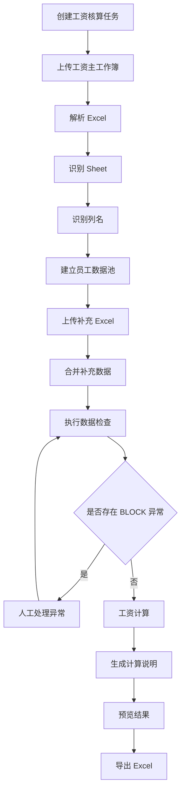
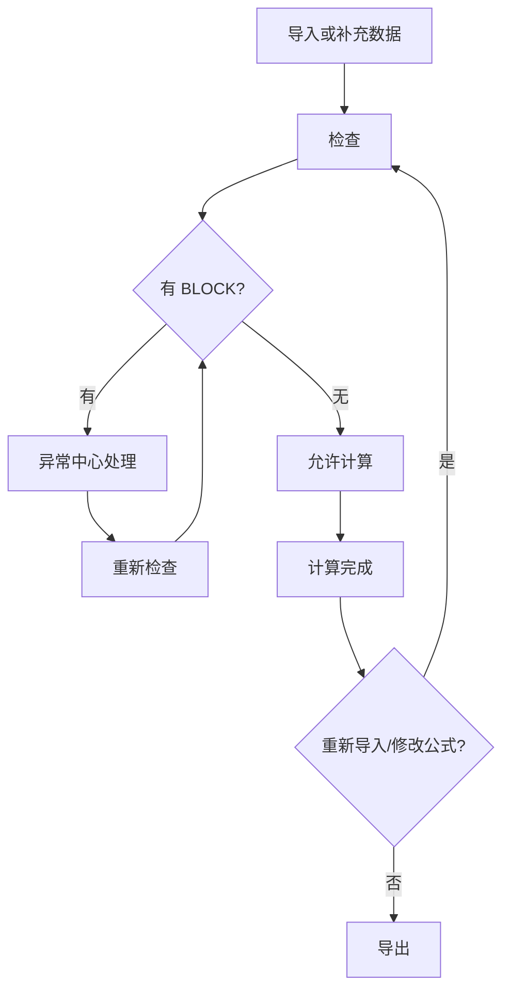

# 02 - Business Flow（业务流程）

> Project: Smart Salary Engine（SSE）  
> Version: V1.2  
> Status: MVP 可开发基线

---

## 1. 主流程总览

---

## 2. Salary Run 状态流转

Salary Run 表示一次完整工资核算任务。

| 状态 | 含义 | 可执行动作 |
|---|---|---|
| CREATED | 已创建，未上传文件 | 上传主工资表 |
| IMPORTING | 文件解析中 | 等待 |
| IMPORTED | 文件已解析，已建立数据池 | 上传补充表、执行检查 |
| CHECKING | 检查中 | 等待 |
| CHECK_FAILED | 存在 BLOCK 异常 | 处理异常、重新检查 |
| CHECK_PASSED | 无 BLOCK 异常 | 发起工资计算 |
| CALCULATING | 工资计算中 | 等待 |
| CALCULATED | 计算完成 | 查看解释、导出 |
| EXPORTED | 已导出工资文件 | 下载、重新导出 |
| FAILED | 系统处理失败 | 查看错误、重试 |

状态原则：

- `CHECK_FAILED` 不允许进入 `CALCULATING`；
- 重新导入补充 Excel 后，状态应回退到 `IMPORTED` 或 `CHECKING`；
- 修改异常处理结果后，必须重新检查；
- 修改公式配置后，必须重新计算；
- 每次计算生成新的 calculation version，不覆盖历史结果。

---

## 3. 详细业务步骤

### 3.1 创建工资核算任务

输入：

- 工资月份：例如 `2026-07`；
- 任务名称：例如 `2026年7月总部工资核算`；
- 备注：可选。

输出：

- `salary_run_id`；
- 任务状态 `CREATED`。

验收：

- 同一用户同一月份可以创建多个任务，但任务名不能重复；
- 创建后可进入上传页面。

---

### 3.2 上传工资主工作簿

输入：

- `.xlsx` 文件；
- 文件类型：`MAIN_WORKBOOK`；
- 是否覆盖当前数据池：默认否。

处理：

1. 保存原始文件；
2. 校验文件类型、大小、是否损坏；
3. 读取 workbook、sheet、表头、数据行；
4. 生成 import batch；
5. 进入 Sheet 识别。

失败场景：

| 场景 | 处理 |
|---|---|
| 非 xlsx 文件 | 返回 `FILE_TYPE_NOT_SUPPORTED` |
| 文件损坏 | 返回 `EXCEL_PARSE_FAILED` |
| 没有可识别 Sheet | 生成 BLOCK 异常 |
| 没有姓名列 | 生成 BLOCK 异常 |

---

### 3.3 Sheet 自动识别

系统根据配置识别 Sheet 类型：

- `salary_main`：工资主表；
- `attendance`：考勤/出勤；
- `bonus`：奖金/提成；
- `deduction`：扣款；
- `social_security`：社保公积金；
- `other`：其他补充表；
- `unknown`：无法识别。

识别结果包含：

- Sheet 原始名称；
- Sheet 类型；
- 命中关键词；
- 置信度；
- 是否需要人工确认。

---

### 3.4 列名自动识别

系统根据字段配置识别标准字段。

示例：

| Excel 原始列 | 标准字段 | 置信度 |
|---|---|---|
| 姓名 | employee_name | 1.00 |
| 基本薪资 | base_salary | 0.95 |
| 应出勤 | attendance_days | 0.90 |
| 绩效 | performance_bonus | 0.80 |

识别失败时：

- 低于阈值的列标记为 `unmapped`；
- 页面展示给 HR 人工选择标准字段；
- 人工映射保存为本任务映射，也可选择加入全局配置。

---

### 3.5 建立员工数据池

处理逻辑：

1. 以标准字段 `employee_name` 作为主要匹配键；
2. 清洗姓名前后空格、全角空格、不可见字符；
3. 同名员工生成 BLOCK 异常；
4. 非重名员工生成 `employee_ref_id`；
5. 每个字段值保存来源信息。

员工数据池不是员工档案库，只服务当前 Salary Run。

---

### 3.6 导入补充 Excel

补充 Excel 可以多次导入。

默认合并策略：

| 情况 | 策略 |
|---|---|
| 原字段为空，新字段有值 | 自动补齐 |
| 原字段有值，新字段为空 | 保留原值 |
| 原字段和新字段相同 | 保留原值，记录新来源 |
| 原字段和新字段不同 | 生成 `DATA_CONFLICT` 异常，人工选择 |
| 出现新员工 | 加入数据池，标记来源为补充表 |
| 发现重名 | 生成 BLOCK 异常，要求检查 Excel 后重新导入 |

---

### 3.7 数据检查

检查时机：

- 主工作簿导入后；
- 补充 Excel 导入后；
- 人工修正异常后；
- 工资计算前。

检查等级：

| 等级 | 含义 | 是否阻断计算 |
|---|---|---|
| BLOCK | 严重异常，必须处理 | 是 |
| WARN | 风险提醒，建议处理 | 否 |
| INFO | 普通提示 | 否 |

---

### 3.8 人工处理异常

异常类型：

- 重名阻断提示；
- 缺失字段补录；
- 字段冲突选择；
- Sheet 类型确认；
- 列映射确认；
- 异常忽略。

处理结果必须记录：

- 处理人；
- 处理时间；
- 处理前值；
- 处理后值；
- 处理原因。

---

### 3.9 工资计算

计算前置条件：

- Salary Run 状态为 `CHECK_PASSED`；
- 无未处理 BLOCK 异常；
- 公式配置有效；
- 必要字段存在；
- 金额字段可转换为 Decimal。

计算输出：

- 每名员工的工资项结果；
- 每个工资项的公式；
- 每个公式的参与字段；
- 每个字段的来源；
- 计算版本号。

---

### 3.10 工资解释

工资解释面向 HR，要求能回答：

- 这个人最终工资是多少；
- 每个工资项怎么算出来；
- 公式是什么；
- 参与计算的数据来自哪个 Excel；
- 哪些数据是人工处理过的；
- 是否存在 WARN 提醒。

---

### 3.11 Excel 导出

导出内容：

- 最终工资表：以工资主表为模板生成，尽量保留原表样式、列宽、表头和格式；
- 计算过程表：作为附加 Sheet；
- 异常处理记录表：作为附加 Sheet；
- 字段来源表：作为附加 Sheet。

导出原则：

- 不修改原始 Excel；
- 每次导出复制工资主表模板生成新文件；
- 结果列可填写到原有列，也可在模板后追加新列；
- 文件名包含工资月份、任务名、导出时间；
- 支持重复下载历史导出文件。

---

## 4. 页面流程

| 页面 | 主要动作 | 下一步 |
|---|---|---|
| 首页 | 查看任务列表、创建任务 | 导入中心 |
| 导入中心 | 上传主表/补充表、确认识别结果 | 数据检查 |
| 数据检查中心 | 查看异常概要 | 异常中心 |
| 异常中心 | 处理 BLOCK/WARN | 重新检查 |
| 工资计算 | 发起计算、查看结果 | 工资解释 |
| 工资解释 | 查看单人计算过程 | 导出中心 |
| 导出中心 | 导出和下载 Excel | 完成 |

---

## 5. 异常回退流程

---

## 6. 关键业务规则

1. 主工资表必须存在姓名列；
2. 发现重名时禁止计算；
3. 工资核心字段缺失时禁止计算；
4. 金额字段无法转换时禁止计算；
5. 补充数据冲突未处理时禁止计算；
6. WARN 异常允许计算，但必须在解释和导出报告中展示；
7. 导出不改变任务状态中的计算版本；
8. 重新计算会生成新的计算版本；
9. 历史计算版本可查询，不默认删除。
