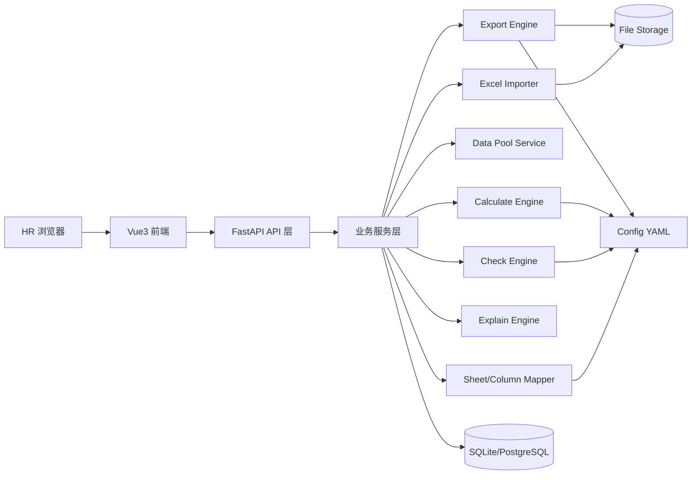
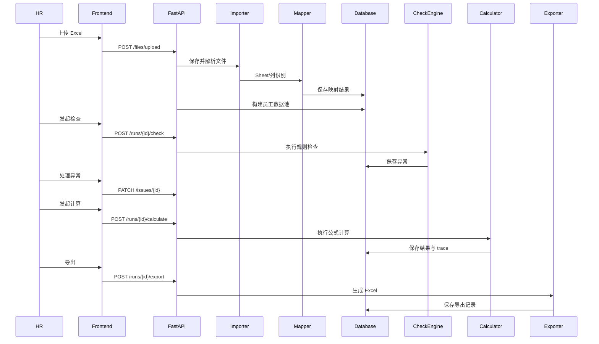

# 04 - Architecture（系统架构）

> Project: Smart Salary Engine（SSE）  
> Version: V1.2  
> Status: MVP 可开发基线

---

## 1. 架构目标

SSE 架构围绕三个目标设计：

1. **Excel 不可变**：原始文件只读保存，所有处理结果另存；
2. **过程可追溯**：字段来源、异常处理、公式计算全留痕；
3. **规则可配置**：Sheet 识别、字段映射、检查、公式、导出列尽量配置化；
4. **导出像原表**：复制工资主表作为模板生成结果文件，尽量保留原表样式。

---

## 2. 总体架构



---

## 3. 技术栈

### 3.1 前端

| 技术 | 用途 |
|---|---|
| Vue 3 | 前端框架 |
| TypeScript | 类型约束 |
| Vite | 构建工具 |
| Element Plus | UI 组件库 |
| Pinia | 状态管理 |
| Vue Router | 路由 |
| Axios | HTTP 请求 |

### 3.2 后端

| 技术 | 用途 |
|---|---|
| Python >=3.13,<3.15 | 运行环境 |
| FastAPI | Web API |
| Pydantic | 请求响应模型校验 |
| SQLAlchemy | ORM |
| SQLite | MVP 本地数据库 |
| PostgreSQL | 后续生产数据库 |
| Pandas | 表格数据处理 |
| OpenPyXL | Excel 读写 |
| Decimal | 金额计算 |
| Pytest | 测试 |

---

## 4. 模块划分

| 模块 | 目录建议 | 职责 |
|---|---|---|
| API Layer | `app/api` | 请求入口、参数校验、响应封装 |
| Service Layer | `app/services` | 编排业务流程、事务控制 |
| Importer | `app/engines/importer` | Excel 文件读取、Sheet 解析 |
| Mapper | `app/engines/mapper` | Sheet 类型识别、字段映射 |
| Data Pool | `app/services/data_pool_service.py` | 员工数据池构建与合并 |
| Check Engine | `app/engines/checker` | 数据异常检查 |
| Calculate Engine | `app/engines/calculator` | 工资公式计算 |
| Explain Engine | `app/engines/explainer` | 计算过程解释生成 |
| Export Engine | `app/engines/exporter` | Excel 导出 |
| Config Loader | `app/core/config_loader.py` | YAML 配置加载和校验 |
| Audit Log | `app/services/audit_service.py` | 操作日志和审计 |

---

## 5. 数据流



---

## 6. 存储设计

### 6.1 文件存储

```text
uploads/
└── {salary_run_id}/
    ├── original/
    │   ├── batch_001_main.xlsx
    │   └── batch_002_bonus.xlsx
    └── parsed_preview/

exports/
└── {salary_run_id}/
    ├── salary_result_v1_20260705_201500.xlsx
    └── salary_result_v2_20260705_203000.xlsx
```

原则：

- 原始文件只读；
- 文件名使用系统生成名称，避免用户文件名冲突；
- 数据库保存原始文件名和存储路径；
- 下载时使用原始文件名或导出文件名；
- 导出文件通过复制工资主表模板生成，不覆盖上传文件。

### 6.2 数据库表

#### salary_run

| 字段 | 类型 | 说明 |
|---|---|---|
| id | string | 任务 ID |
| name | string | 任务名称 |
| payroll_month | string | 工资月份，YYYY-MM |
| status | string | 状态 |
| current_calc_version | int | 当前计算版本 |
| created_by | string | 创建人 |
| created_at | datetime | 创建时间 |
| updated_at | datetime | 更新时间 |

#### import_batch

| 字段 | 类型 | 说明 |
|---|---|---|
| id | string | 批次 ID |
| salary_run_id | string | 任务 ID |
| file_id | string | 文件 ID |
| file_role | string | MAIN/SUPPLEMENT |
| status | string | PARSED/FAILED |
| created_at | datetime | 导入时间 |

#### workbook_file

| 字段 | 类型 | 说明 |
|---|---|---|
| id | string | 文件 ID |
| salary_run_id | string | 任务 ID |
| original_name | string | 原始文件名 |
| storage_path | string | 存储路径 |
| file_size | int | 文件大小 |
| file_hash | string | 文件哈希 |
| created_at | datetime | 上传时间 |

#### sheet_mapping

| 字段 | 类型 | 说明 |
|---|---|---|
| id | string | ID |
| import_batch_id | string | 导入批次 |
| sheet_name | string | 原始 Sheet 名 |
| sheet_type | string | 识别类型 |
| confidence | decimal | 置信度 |
| need_confirm | bool | 是否需要确认 |
| confirmed_by | string | 确认人 |

#### column_mapping

| 字段 | 类型 | 说明 |
|---|---|---|
| id | string | ID |
| sheet_mapping_id | string | Sheet 映射 ID |
| original_column | string | 原始列名 |
| field_code | string | 标准字段编码 |
| confidence | decimal | 置信度 |
| need_confirm | bool | 是否需要确认 |

#### employee_record

| 字段 | 类型 | 说明 |
|---|---|---|
| id | string | employee_ref_id |
| salary_run_id | string | 任务 ID |
| employee_name | string | 员工姓名 |
| status | string | NORMAL/NAME_DUPLICATE/IGNORED |

#### employee_field_value

| 字段 | 类型 | 说明 |
|---|---|---|
| id | string | ID |
| employee_record_id | string | 员工记录 ID |
| field_code | string | 标准字段 |
| value_text | string | 原始文本值 |
| value_decimal | decimal/null | 金额/数字值 |
| value_type | string | 字段类型 |
| source_file_id | string | 来源文件 |
| source_sheet | string | 来源 Sheet |
| source_row | int | 来源行 |
| source_column | string | 来源列 |
| import_batch_id | string | 来源批次 |
| is_manual | bool | 是否人工修改 |
| manual_reason | string/null | 人工补录或修改原因 |
| manual_by | string/null | 人工补录或修改人 |
| manual_at | datetime/null | 人工补录或修改时间 |

#### check_issue

| 字段 | 类型 | 说明 |
|---|---|---|
| id | string | 异常 ID |
| salary_run_id | string | 任务 ID |
| employee_record_id | string/null | 员工 ID |
| issue_code | string | 异常编码 |
| level | string | BLOCK/WARN/INFO |
| field_code | string/null | 相关字段 |
| message | string | 异常说明 |
| status | string | OPEN/RESOLVED/IGNORED |
| resolve_action | string/null | 处理方式 |
| resolved_by | string/null | 处理人 |
| resolved_at | datetime/null | 处理时间 |

#### calculation_result

| 字段 | 类型 | 说明 |
|---|---|---|
| id | string | ID |
| salary_run_id | string | 任务 ID |
| employee_record_id | string | 员工 ID |
| calc_version | int | 计算版本 |
| item_code | string | 工资项编码 |
| item_name | string | 工资项名称 |
| amount | decimal | 金额 |
| formula | string | 公式 |
| created_at | datetime | 计算时间 |

#### calculation_trace

| 字段 | 类型 | 说明 |
|---|---|---|
| id | string | ID |
| calculation_result_id | string | 计算结果 ID |
| step_order | int | 步骤顺序 |
| expression | string | 表达式 |
| input_values_json | json | 输入字段和值 |
| result_value | decimal/string | 结果 |
| source_json | json | 来源信息 |

#### export_file

| 字段 | 类型 | 说明 |
|---|---|---|
| id | string | 导出 ID |
| salary_run_id | string | 任务 ID |
| calc_version | int | 计算版本 |
| template_file_id | string | 使用的工资主表模板文件 |
| file_name | string | 文件名 |
| storage_path | string | 文件路径 |
| created_by | string | 导出人 |
| created_at | datetime | 导出时间 |

---

## 7. 配置文件

```text
config/
├── fields.yaml          # 标准字段与别名
├── sheet_rules.yaml     # Sheet 识别规则
├── check_rules.yaml     # 检查规则
├── formula_rules.yaml   # 工资公式
└── export_templates.yaml# 导出列模板
```

配置加载要求：

- 启动时校验配置格式；
- 配置错误时服务启动失败；
- 公式字段不存在时禁止计算；
- MVP 可以通过文件配置，后续再做配置页面。

---

## 8. 并发与隔离

MVP 按一台电脑单用户使用设计，并发策略保持简单：

1. 每个 Salary Run 独立隔离；
2. 同一 Salary Run 同一时间只允许一个导入/检查/计算任务执行；
3. 后端通过状态字段阻止同一任务重复导入/检查/计算；
4. 重复点击计算按钮，若已有计算任务进行中，返回 `RUN_BUSY`；
5. 导入、检查、计算可以先同步完成，后续数据量变大再升级为 job/status。

任务锁建议：

- SQLite MVP：数据库状态字段 + 乐观更新；
- PostgreSQL 后续：行级锁或 advisory lock。

---

## 9. 认证与权限

MVP 最低要求：

- 本机单用户登录后访问系统；
- API 使用简单 Bearer Token 或 Session Cookie；
- 上传、计算、导出记录操作人；
- 日志不打印完整工资数据；
- 文件下载需要权限校验。

后续权限矩阵：

| 操作 | HR | Reviewer | Admin |
|---|---|---|---|
| 创建任务 | 是 | 否 | 是 |
| 上传 Excel | 是 | 否 | 是 |
| 处理异常 | 是 | 否 | 是 |
| 工资计算 | 是 | 否 | 是 |
| 查看解释 | 是 | 是 | 是 |
| 导出 | 是 | 是 | 是 |
| 修改配置 | 否 | 否 | 是 |

---

## 10. 错误处理

统一错误响应：

```json
{
  "success": false,
  "error_code": "EXCEL_PARSE_FAILED",
  "message": "Excel 文件解析失败，请确认文件未损坏且格式为 .xlsx",
  "request_id": "req_20260705_001",
  "details": {}
}
```

错误分类：

| 分类 | 示例 |
|---|---|
| 参数错误 | INVALID_ARGUMENT |
| 文件错误 | FILE_TYPE_NOT_SUPPORTED, EXCEL_PARSE_FAILED |
| 状态错误 | RUN_STATUS_NOT_ALLOWED, RUN_BUSY |
| 业务异常 | BLOCK_ISSUE_EXISTS, FORMULA_CONFIG_INVALID |
| 系统异常 | INTERNAL_ERROR |

---

## 11. 部署方案

### 11.1 MVP 本地部署

```text
Browser -> Vue Static Server / Nginx -> FastAPI -> SQLite + Local File Storage
```

适合单人/小团队试用。

### 11.2 后续生产部署

```text
Browser -> Nginx -> Frontend Static Files
                  -> FastAPI App -> PostgreSQL
                                 -> Object Storage / NAS
                                 -> Redis / Queue
```

---

## 12. 日志与审计

日志要求：

- 每个请求生成 `request_id`；
- 上传、导入、检查、计算、导出记录 audit log；
- 错误日志记录堆栈，但敏感字段脱敏；
- 工资金额、身份证、银行卡等敏感字段默认不进普通日志。

审计事件：

| 事件 | 说明 |
|---|---|
| FILE_UPLOADED | 上传文件 |
| SHEET_MAPPING_CONFIRMED | 确认 Sheet 类型 |
| COLUMN_MAPPING_CONFIRMED | 确认列映射 |
| ISSUE_RESOLVED | 处理异常 |
| CALCULATION_STARTED | 开始计算 |
| CALCULATION_FINISHED | 计算完成 |
| FILE_EXPORTED | 导出文件 |

---

## 13. 架构验收标准

1. 系统重启后任务数据不丢失；
2. 原始 Excel 不被修改；
3. 同一任务并发计算被阻止；
4. 所有计算结果能追溯到字段来源；
5. 配置错误能被启动时或计算前发现；
6. 文件下载必须校验权限；
7. 核心引擎可以独立单元测试。
