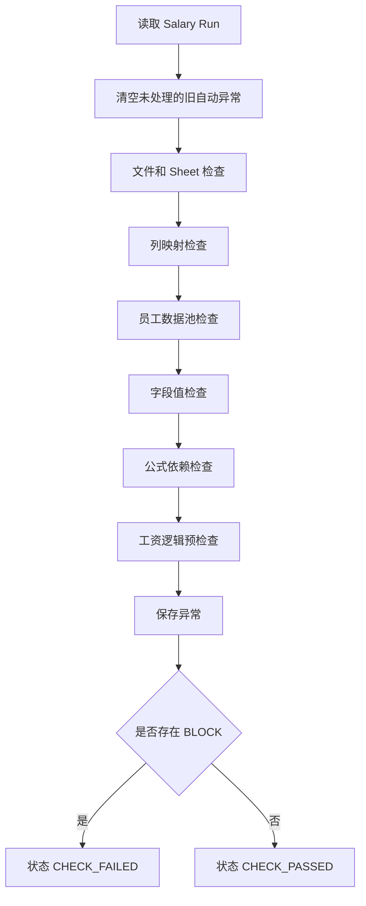

# 06 - Check Engine（数据检查引擎）

> Project: Smart Salary Engine（SSE）  
> Version: V1.2  
> Status: MVP 可开发基线

---

## 1. 设计目标

Check Engine 用于在工资计算前发现数据风险，防止错误发薪。

核心目标：

1. 统一检查文件、Sheet、列、员工、字段、金额、公式依赖；
2. 将异常分为 BLOCK/WARN/INFO；
3. BLOCK 异常未处理时禁止计算；
4. 异常必须可定位到员工、字段和来源；
5. 异常处理过程可审计。

---

## 2. 异常等级

| 等级 | 含义 | 是否阻断计算 | 示例 |
|---|---|---|---|
| BLOCK | 严重异常，必须处理 | 是 | 缺少姓名、金额非法、姓名重复 |
| WARN | 风险提醒，建议处理 | 否 | 工资异常偏高、补贴为负 |
| INFO | 普通提示 | 否 | 某 Sheet 未参与计算 |

---

## 3. 异常状态

| 状态 | 含义 |
|---|---|
| OPEN | 未处理 |
| RESOLVED | 已解决 |
| IGNORED | 已忽略 |
| AUTO_RESOLVED | 系统自动解决 |

计算前判断：

```text
存在 level = BLOCK 且 status = OPEN 的异常 => 禁止计算
```

---

## 4. 检查范围

| 类别 | 检查内容 |
|---|---|
| 文件检查 | 文件格式、文件损坏、空文件、重复上传 |
| Sheet 检查 | 无主表、未知 Sheet、重复主表 |
| 列检查 | 缺少必填列、重复列、未映射列 |
| 员工检查 | 姓名为空、重名、重复行 |
| 字段检查 | 必填字段缺失、类型非法、金额非法 |
| 合并检查 | 多来源字段冲突、来源丢失 |
| 逻辑检查 | 出勤天数范围、应发/实发关系 |
| 工资异常 | 金额过高、过低、负数异常 |
| 公式依赖 | 公式字段缺失、循环依赖 |

---

## 5. 检查规则配置

示例：

```yaml
check_rules:
  required_employee_name:
    name: 姓名不能为空
    level: BLOCK
    type: required
    field: employee_name
    message: 员工姓名不能为空

  required_base_salary:
    name: 基本工资不能为空
    level: BLOCK
    type: required
    field: base_salary
    message: 基本工资缺失，无法计算工资

  money_format:
    name: 金额格式检查
    level: BLOCK
    type: money_format
    fields: [base_salary, performance_bonus, other_deduction]

  attendance_range:
    name: 出勤天数范围检查
    level: WARN
    type: range
    field: attendance_days
    min: 0
    max: 31

  net_salary_negative:
    name: 实发工资不能为负
    level: BLOCK
    type: expression
    expression: "net_salary >= 0"

  salary_too_high:
    name: 工资异常偏高
    level: WARN
    type: expression
    expression: "net_salary <= 100000"
```

---

## 6. 具体检查项

### 6.1 文件检查

| 编码 | 检查项 | 等级 | 说明 |
|---|---|---|---|
| FILE_TYPE_NOT_SUPPORTED | 文件格式不支持 | BLOCK | 只支持 `.xlsx` |
| FILE_EMPTY | 文件为空 | BLOCK | 无可读取内容 |
| FILE_PARSE_FAILED | 文件解析失败 | BLOCK | 文件损坏或格式异常 |
| FILE_DUPLICATED | 文件重复上传 | WARN | 同一 hash 文件已导入 |

---

### 6.2 Sheet 检查

| 编码 | 检查项 | 等级 | 说明 |
|---|---|---|---|
| MAIN_SHEET_MISSING | 缺少工资主表 | BLOCK | 没有识别到 `salary_main` |
| MAIN_SHEET_MULTIPLE | 多个工资主表 | BLOCK | 需要人工确认主表 |
| SHEET_UNKNOWN | 未知 Sheet | WARN | 未参与处理 |
| SHEET_NEED_CONFIRM | Sheet 识别需确认 | WARN/BLOCK | 关键 Sheet 为 BLOCK |

---

### 6.3 列检查

| 编码 | 检查项 | 等级 | 说明 |
|---|---|---|---|
| NAME_COLUMN_MISSING | 缺少姓名列 | BLOCK | 无法建立员工数据池 |
| REQUIRED_COLUMN_MISSING | 必填列缺失 | BLOCK | 公式依赖字段缺失 |
| COLUMN_DUPLICATED | 重复列 | WARN/BLOCK | 关键字段重复为 BLOCK |
| COLUMN_MAPPING_LOW_CONFIDENCE | 列映射低置信度 | WARN | 需要人工确认 |

---

### 6.4 员工检查

| 编码 | 检查项 | 等级 | 说明 |
|---|---|---|---|
| EMPLOYEE_NAME_EMPTY | 姓名为空 | BLOCK | 无法匹配员工 |
| EMPLOYEE_DUPLICATED | 姓名重复 | BLOCK | 检查 Excel 后重新上传或忽略无效行 |
| EMPLOYEE_ROW_DUPLICATED | 同一 Sheet 重复行 | BLOCK/WARN | 按来源字段决定 |
| EMPLOYEE_IGNORED | 员工被忽略 | INFO | 不参与计算 |

---

### 6.5 字段检查

| 编码 | 检查项 | 等级 | 说明 |
|---|---|---|---|
| FIELD_REQUIRED_MISSING | 必填字段缺失 | BLOCK | 计算无法继续 |
| FIELD_TYPE_INVALID | 字段类型非法 | BLOCK | 金额/日期等无法转换 |
| FIELD_SOURCE_MISSING | 字段来源缺失 | BLOCK | 违反可追溯原则 |
| DATA_CONFLICT | 多来源字段冲突 | BLOCK/WARN | 需要选择来源 |

---

### 6.6 工资逻辑检查

| 编码 | 检查项 | 等级 | 默认规则 |
|---|---|---|---|
| BASE_SALARY_NEGATIVE | 基本工资为负 | BLOCK | base_salary >= 0 |
| ATTENDANCE_DAYS_OUT_OF_RANGE | 出勤天数异常 | WARN | 0 <= attendance_days <= 31 |
| GROSS_SALARY_NEGATIVE | 应发工资为负 | BLOCK | gross_salary >= 0 |
| NET_SALARY_NEGATIVE | 实发工资为负 | BLOCK | net_salary >= 0 |
| DEDUCTION_TOO_HIGH | 扣款过高 | WARN | deduction_total <= gross_salary |
| SALARY_TOO_HIGH | 工资异常偏高 | WARN | net_salary <= 配置阈值 |
| SALARY_TOO_LOW | 工资异常偏低 | WARN | net_salary >= 配置阈值 |

---

## 7. 检查执行流程



---

## 8. 异常处理动作

| 动作 | 适用异常 | 说明 |
|---|---|---|
| CONFIRM | Sheet、列映射 | 人工确认 |
| FILL_VALUE | 缺失字段 | 人工补录，作为正式数据保存 |
| CHOOSE_SOURCE | 数据冲突 | 选择一个来源值 |
| IGNORE_ROW | 无效员工行 | 忽略该行 |
| IGNORE_ISSUE | WARN/INFO | 忽略提醒 |
| REUPLOAD | 文件问题 | 重新上传 |

处理要求：

- BLOCK 异常不能直接忽略，除非规则允许；
- WARN 可忽略，但必须记录原因；
- 人工补录值必须标记 `is_manual = true`，并记录处理人、时间和原因；
- 处理后必须重新检查。

---

## 9. 异常响应结构

```json
{
  "id": "issue_001",
  "salary_run_id": "run_001",
  "level": "BLOCK",
  "issue_code": "FIELD_REQUIRED_MISSING",
  "message": "张三缺少基本工资，无法计算工资",
  "employee_ref_id": "emp_001",
  "employee_name": "张三",
  "field_code": "base_salary",
  "status": "OPEN",
  "source": {
    "file_name": "7月工资表.xlsx",
    "sheet_name": "工资表",
    "row_index": 12,
    "column_name": "基本工资"
  }
}
```

---

## 10. 前端展示要求

异常中心需要支持：

- 按等级筛选；
- 按状态筛选；
- 按员工姓名搜索；
- 按字段筛选；
- 展示来源定位；
- 批量处理 WARN；
- BLOCK 异常置顶；
- 显示“还剩多少 BLOCK 未处理”。

---

## 11. 验收标准

1. 缺少姓名列会产生 BLOCK；
2. 姓名重复会产生 BLOCK；
3. 必填工资字段缺失会产生 BLOCK；
4. 金额格式非法会产生 BLOCK；
5. WARN 不阻断计算；
6. BLOCK 未处理时计算接口返回错误；
7. 异常处理记录可查询；
8. 异常能定位到员工和来源 Excel；
9. 重新导入后会重新检查。
